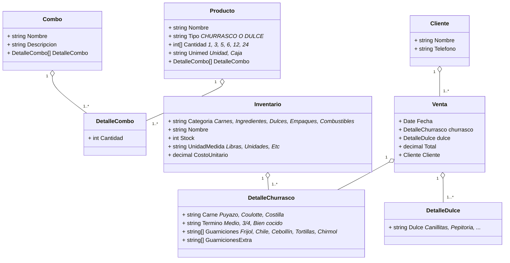

-   [Enunciado de restaurante](#enunciado-de-restaurante)
    -   [Churrascos](#churrascos)
        -   [Configuración de los churrascos](#configuración-de-los-churrascos)
    -   [Dulces típicos](#dulces-típicos)
        -   [Tipos de dulces típicos](#tipos-de-dulces-típicos)
    -   [Combos](#combos)
    -   [Inventario a controlar](#inventario-a-controlar)
-   [Diagrama de clases](#diagrama-de-clases)

# Enunciado de restaurante

Una tienda dedicada a la veta de dulces típicos y churrasco necesita un sistema de gestión integral para controlar sus productos.

## Churrascos

Los churrascos se comercializan en dos modalidades:

1. Plato individual
2. Plato familiar (incluye 3 o 5 porciones)

Cada porción incluye dos guarniciones a elegir entre:

-   Frijoles
-   Chile de árbol
-   Cebollín
-   Tortillas
-   Chirmol

### Configuración de los churrascos

1. Tipo de carne
    1. Puyazo
    2. Coulotte
    3. Costilla
2. Término de cocción
    1. Término medio
    2. Término tres cuartos
    3. Bien cocido
3. Guarniciones seleccionables
4. Porciones extra de guarniciones

## Dulces típicos

Los dulces típicos se venden por unidad o en cajas de diferentes capacidades:

-   6 unidades
-   12 unidades
-   24 unidades

### Tipos de dulces típicos

1. Canillitas de leche
2. Pepitoria
3. Cocadas
4. Dulces de higo
5. Mazapanes
6. Chilacayotes
7. Conservas de coco
8. Colochos de guayaba

## Combos

1. Combo familiar
    1. 1 plato familiar de churrasco
    2. 1 caja de dulces típicos
2. Combo para eventos
    1. 3 platos familiares de churrasco
    2. 2 cajas grandes de dulces típicos
3. Combos personalizados según temporada

## Inventario a controlar

-   Carnes por libra
-   Ingredientes para guarniciones
-   Dules por unidad
-   Cajas y empaques
-   Carbón y leña

# Diagrama de clases



Modelos en C# para MongoDB

```C#
using MongoDB.Bson;
using MongoDB.Bson.Serialization.Attributes;
using MongoDB.Driver;
using System;
using System.Collections.Generic;

public class Combo
{
    [BsonId]
    [BsonRepresentation(BsonType.ObjectId)]
    public string Id { get; set; }
    public string Nombre { get; set; }
    public string Descripcion { get; set; }
    public List<DetalleCombo> DetalleCombo { get; set; } = new();
}

public class DetalleCombo
{
    public int Cantidad { get; set; }
}

public class Cliente
{
    [BsonId]
    [BsonRepresentation(BsonType.ObjectId)]
    public string Id { get; set; }
    [BsonIndex]
    public string Nombre { get; set; }
    [BsonIndex]
    public string Telefono { get; set; }
}

public class Producto
{
    [BsonId]
    [BsonRepresentation(BsonType.ObjectId)]
    public string Id { get; set; }
    [BsonIndex]
    public string Nombre { get; set; }
    public string Tipo { get; set; } // CHURRASCO o DULCE
    public List<int> Cantidad { get; set; } = new() { 1, 3, 5, 6, 12, 24 };
    public string Unimed { get; set; } // Unidad o Caja
    public List<DetalleCombo> DetalleCombo { get; set; } = new();
}

public class Venta
{
    [BsonId]
    [BsonRepresentation(BsonType.ObjectId)]
    public string Id { get; set; }
    [BsonIndex]
    public DateTime Fecha { get; set; }
    public DetalleChurrasco Churrasco { get; set; }
    public DetalleDulce Dulce { get; set; }
    public decimal Total { get; set; }
    [BsonRepresentation(BsonType.ObjectId)]
    public string ClienteId { get; set; }
}

public class Inventario
{
    [BsonId]
    [BsonRepresentation(BsonType.ObjectId)]
    public string Id { get; set; }
    [BsonIndex]
    public string Categoria { get; set; } // Carnes, Ingredientes, etc.
    [BsonIndex]
    public string Nombre { get; set; }
    public int Stock { get; set; }
    public string UnidadMedida { get; set; } // Libras, Unidades, etc.
    public decimal CostoUnitario { get; set; }
}

public class DetalleChurrasco
{
    public string Carne { get; set; } // Puyazo, Coulotte, Costilla
    public string Termino { get; set; } // Medio, 3/4, Bien cocido
    public List<string> Guarniciones { get; set; } = new();
    public List<string> GuarnicionesExtra { get; set; } = new();
}

public class DetalleDulce
{
    public string Dulce { get; set; } // Canillitas, Pepitoria, etc.
}

```
